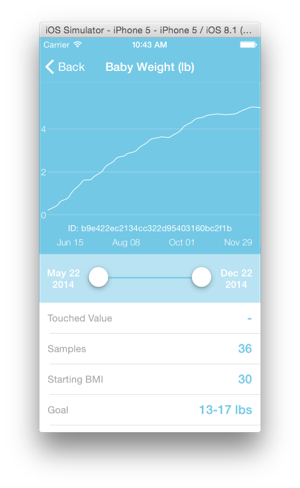
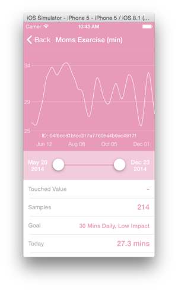
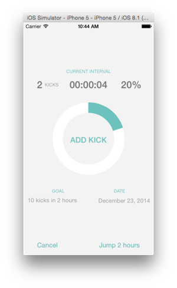

# M2X Healthy Baby app
Healthy Baby is an iOS application that demonstrates how a consumer facing health and wellness application can utilize the [AT&T M2X](https://m2x.att.com) service.  

## Installation

* install Xcode 6.1
* clone the repository
* `git submodule update --init --recursive`
* open M2XDemo.xcodeproj on Xcode and hit run

## Screenshots

## API Keys

Note that the the app uses some services like parse.com and crashlytics. If you want to use the services, make sure you have a keys/keys.json and then run ./insert-keys.js. Inside that script you can see the list of used tokens for the keys.

## Notes

* Weight, Glucose and Exercise sections create past data on the fly on M2X (considering now as 7 months from pregnancy)
* Activity section shows data that is created from the app with the 'Kicks' tracker
* To receive push notifications, make sure you configured the parse.com api keys and you're trying on a real device (won't work on simulator)
* Since M2X API is asynchronous, there could be some delay of the created data to appear on the charts

### Attributions
Written by [Luis Floreani](https://github.com/lucholaf), sponsored by [Citrusbyte](https://citrusbyte.com/)
